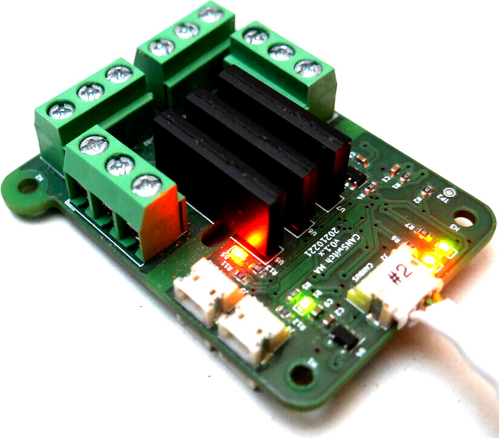
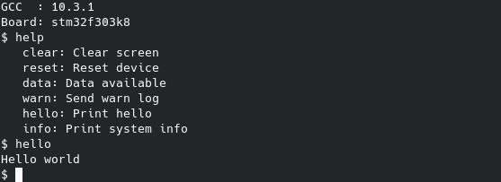

# Libfosh

<div align="center" width="100%" style="vertical-align: middle;" valign="middle">
    
</div>

## Overview

Libfosh provides a simple command line interface for microcontrollers like 
STM32 with flash sizes down to 16 KByte. Even the simplest cursor control may 
not exist (yet). The main purpose is to configure and debug small bare metal 
applications without any filesystem. Commands can directly call C functions or 
call C++ methods of objects.

Libfosh is using stdio libc-commands for I/O. Some syscalls may have to be 
implemented by the application to use UART or a USB interface (or use libbiwak 
which provides those functions). The input should be non-blocking.
Libfosh depends on liblepto. Libbiwak is optional.

There are some example commands implemented. Costom commands can be implemented 
directly by inheriting tha base command class or by using libleptos signal/slot 
mechanisms.

<div align="center" width="100%" style="vertical-align: middle;" valign="middle">
    
</div>

(Naming is from 'Formica' (genus of ants commonly known as 'wood ants') and 
'shell')

## Compile library

To compile the library for an microcontroller an according toolchain has to be 
installed and configured.

The repository can be included into an CMake project as a
subdirectory ( 'add_subdirectory( libfosh )' ) via GIT submodule.

## Using libfosh

Example for running basic fosh:
```
#include <fosh/fosh.hpp>
#include <fosh/commands/clear.hpp>
#include <fosh/commands/exit.hpp>

int main(int argc, char* argv[])
{
    CFosh fosh;
    fosh.addCommand( new CCommandClear("clear") );
    fosh.addCommand( new CCommandExit("exit") );
    
    while(1)
    {
       fosh.eventLoop();
       usleep( 1000 );
    }
    return(0);
}
```

After starting the application, a 'login:' prompt will appear. Enter "admin" 
+Enter-key. The only reason for this first prompt is to avoid 
accidentally executing commands when device is not connected to a host and UART 
pullup resistors are missing.
This first prompt can be disabled by compiling the complete code with setting 
the predefine 'CONFIG_FOSH_LOGIN=0'. Take care that all compile units which are
including 'fosh.hpp' need this predefine then.

The example above is a little bit boring. The shell can only be exited. 

Lets add an command calling an function with the help of the generic 
signal-command:
```
[...]
int hello(int argc, const char* argv[])
{
   printf("Hello world\n");
   return(0);
}
[...]
int main(int argc, char* argv[])
{
    CFosh fosh;
    fosh.addCommand( new CCommandClear("clear") );
    fosh.addCommand( new CCommandExit("exit") );
    fosh.addCommand( new CCommandSignal("hello", "Hello world", hello ) );
    
    while(1)
    {
       fosh.eventLoop();
       usleep( 1000 );
    }
    return(0);
}
```

With this changes an command 'hello' is added which will print "Hello world".

To interact with an object of an C++ class an similar approach can be made:
```
[...]
class CClass
{
   public:
      int hello(int argc, const char* argv[])
      {
         printf("Hello world\n");
         return(0);
      }
}
[...]
int main(int argc, char* argv[])
{
    CFosh fosh;
    CClass hello;
    fosh.addCommand( new CCommandClear("clear") );
    fosh.addCommand( new CCommandExit("exit") );
    fosh.addCommand( new CCommandSignal("hello", "Print hello"
                                        ,&hello, &CClass::hello ) );
    
    while(1)
    {
       fosh.eventLoop();
       usleep( 1000 );
    }
    return(0);
}
```
The command 'hello' will call method 'hello' of the object 'hello' of class 
CClass.
